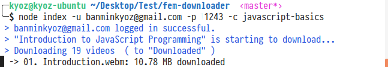

# Fem Downloader 
Simple Downloader for frontendmasters.com's courses to watch offline



# Use it as your own risk
- Time passed and things changed. I'v write this about 2 years ago and i'm no longer using this. I just now that at the moment, Frontend Master will ban account that trying to download their video. [View this issue](https://github.com/kyoz/fem-downloader/issues/1)
- I recommend using their app on mobile to download their videos and watch offine if you'd like.

# Requirements
- Node 9+
- A free frontendmasters.com's account ( Or membership account to download courses that not free xD )

# Install 

```bash
  # Clone Repo
  git clone git@github.com:banminkyoz/fem-downloader
  # Install packages
  npm i
```

# Usage

```bash
  # Download
  node index -u [username/email] -p [password] -c [slugName]
```

# Examples

```bash
node index -u banminkyoz@gmail.com -p 123456 -c javascript-basics
```

With:

- Email: banminkyoz@gmail.com
- Password: 123456
- SlugName: javascript-basics

:warning: slugName must be correct or else the downloader will not work. ex: with [https://frontendmasters.com/courses/javascript-basics/](https://frontendmasters.com/courses/javascript-basics/) the slugName must be `javascript-basics` (without slash)


# Custom Usage

You can use these arguments to custom your download:
- **s ( skip )**: To skip video. Default: 0
- **f ( format )**: Video format types ( webm or mp4 ). Default: 'webm'
- **r ( resolution )**: Resolution of video ( 720 or 1080 ). Default: '1080'
- **d ( dest )**: Destination download folder. (Default download folder is in 'Downloaded' in this project folder')

ex:
```bash
  # Skip 3 videos, start download at fourth video
  node index -u banminkyoz@gmail.com -p 123456 -c [slugName] --s 3 
  # Set format type and resolution
  node index -u banminkyoz@gmail.com -p 123456 -c [slugName] --f mp4 --r 720
  # Download to a specific folder
  node index -u banminkyoz@gmail.com -p 123456 -d '/Users/Kyoz/Downloads'
```
